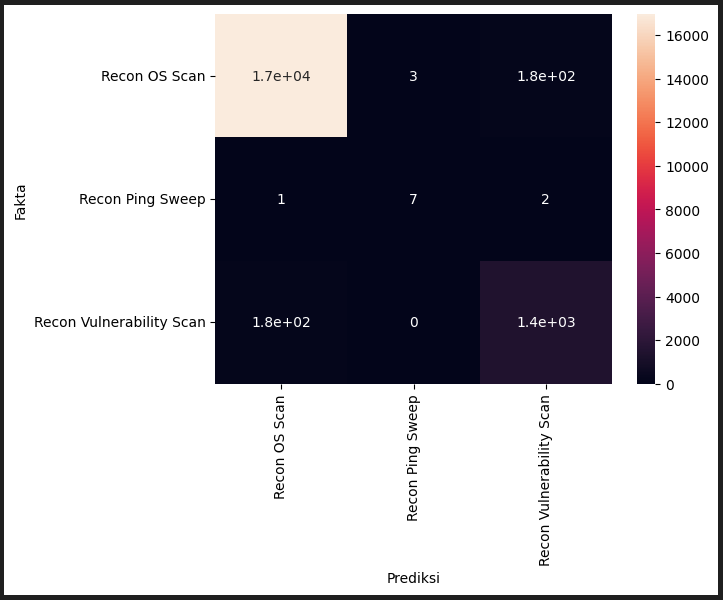
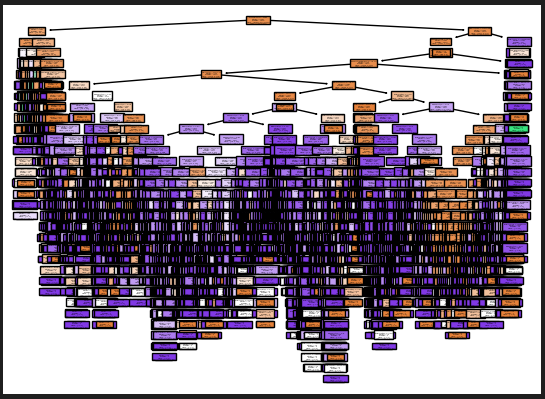

# Analisis Trafik Jaringan Menggunakan Decision Tree

## Deskripsi Proyek

Proyek ini bertujuan untuk melakukan analisis terhadap **trafik jaringan** guna mendeteksi aktivitas reconnaissance (pengintaian) menggunakan algoritma **Decision Tree**. Analisis dilakukan dengan memanfaatkan tiga dataset utama:

1. **Recon OS Scan.csv** – Trafik dari aktivitas pemindaian sistem operasi.
2. **Recon Ping Sweep.csv** – Trafik dari pemindaian jaringan untuk menemukan host aktif.
3. **Recon Vulnerability Scan.csv** – Trafik dari proses pemindaian celah keamanan.

### Metode

Model dikembangkan menggunakan algoritma **Decision Tree Classifier** karena sifatnya yang interpretatif dan kemampuannya untuk mengelompokkan data berdasarkan fitur-fitur penting. Data dibersihkan dan digabung, lalu dilatih untuk mengenali pola dari ketiga jenis serangan berdasarkan fitur trafik.

## Hasil Evaluasi

### 🔍 Confusion Matrix

- Model menunjukkan akurasi tinggi dalam mengklasifikasikan **Recon OS Scan** dengan prediksi benar sekitar **17.000 data**.
- Untuk **Recon Vulnerability Scan**, model juga bekerja cukup baik, meskipun terdapat kesalahan prediksi sebanyak ±180 data yang diklasifikasikan sebagai OS Scan.
- Klasifikasi untuk **Recon Ping Sweep** belum optimal karena jumlah data yang tersedia sangat sedikit, sehingga model kesulitan dalam mengenali pola yang konsisten.

### 🌳 Visualisasi Pohon Keputusan

Pohon keputusan menunjukkan struktur pemisahan berbasis fitur yang cukup dalam dan kompleks. Visualisasi ini memberikan wawasan mengenai fitur-fitur mana yang paling berkontribusi dalam pengambilan keputusan klasifikasi.

## Kesimpulan

Metode **Decision Tree** terbukti efektif untuk mengklasifikasikan trafik berdasarkan jenis aktivitas reconnaissance tertentu, khususnya saat data yang tersedia seimbang. Namun, performa akan lebih optimal jika distribusi dataset lebih merata, terutama pada kelas minoritas seperti Ping Sweep. Model ini dapat dikembangkan lebih lanjut untuk digunakan sebagai bagian dari sistem deteksi intrusi (IDS).
